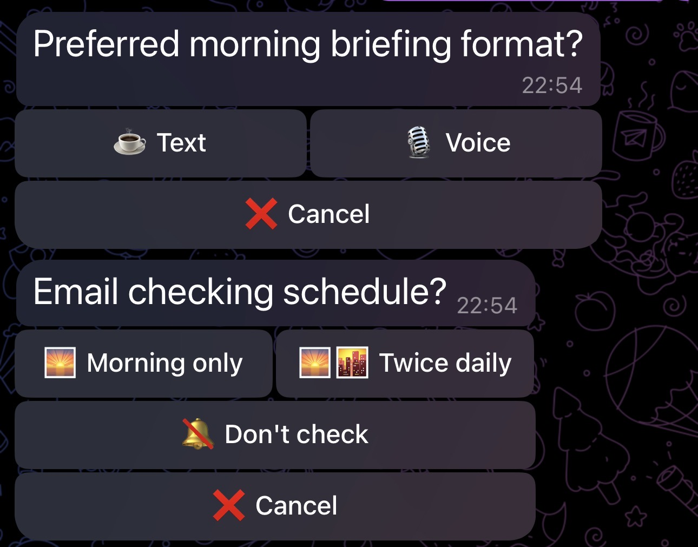

# telegram-inline-keyboards



An AI skill for generating Telegram Bot API inline keyboard JSON — from simple yes/no prompts to multi-step wizards and contextual action buttons.

Framework-agnostic. Works with any Telegram bot (grammY, python-telegram-bot, raw HTTP) and has first-class [OpenClaw](https://openclaw.ai) integration.

## What it does

This skill teaches an AI assistant how to produce well-structured `InlineKeyboardMarkup` JSON for Telegram bots. Instead of dumping a wall of buttons, it follows opinionated UX guidelines: keep keyboards compact, always offer an escape hatch, and use the right pattern for the job.

### Patterns

| # | Pattern | When to use |
|---|---------|-------------|
| 1 | **Yes / No** | Binary confirmations — emoji-only for low-stakes, emoji + text for consequences |
| 2 | **Multiple choice** | Single select from 2–6 options (vertical for long labels, grid for short) |
| 3 | **Multi-select toggle** | Pick multiple items with visual toggle state |
| 4 | **Multi-question panel** | 2–3 short questions in one compact message |
| 5 | **Multi-step wizard** | Sequential flows with back/cancel, state tracking, free-text steps |
| 6 | **Rating / scale** | 1–5 stars, NPS scores, satisfaction |
| 7 | **Pagination** | Browse lists with prev/next navigation |
| 8 | **URL + callback mixed** | Combine external links with bot actions |
| 9 | **Action buttons** | Contextual operations on notifications: snooze, watch, save, mute, refresh |

### Design principles

The skill encodes strong opinions about keyboard UX:

- **Collect silently, submit explicitly.** When a keyboard collects multiple answers, each tap records silently (brief toast at most). The AI only processes everything when the user taps "✅ Confirm". No mid-flow responses.
- **No meta-commentary.** The bot never explains how the keyboard works — no "I will collect your answers silently", no "here are three questions", no "tap Submit when done". Questions and buttons are the interface. They don't need an instruction manual.
- **Buttons next to their question.** Each question's options appear directly below it. Never a blob of text followed by a blob of buttons. Use one message per question when collecting multiple answers.
- **Don't keyboard everything.** Plain text is fine when the conversation flows naturally. Keyboards are accelerators for predictable choices, not the default.
- **Always include "✏️ Other".** Every multiple-choice keyboard gets a free-text escape because the user's real answer is almost never limited to the options you thought of.
- **Always include "❌ Cancel".** The user should never be trapped in a flow. A keyboard without an exit is a cage.
- **Keep it compact.** 3–5 rows max. If it scrolls, split it into steps.
- **Use emoji for binary choices.** `✅`/`❌` beats "Yes"/"No" — faster to scan, smaller footprint.
- **Long labels go vertical.** Grid layouts only work with short labels (~12 chars). Anything longer gets one button per row.
- **Actions, not just questions.** Notifications should offer to *do something* — snooze, watch for changes, save to memory — not just inform.

## File structure

```
telegram-inline-keyboards/
├── SKILL.md                      # Main skill (core concepts, pattern summaries, OpenClaw integration)
├── references/
│   ├── patterns.md               # Full JSON examples for all 9 patterns + anti-patterns
│   └── routing.md                # Pseudocode callback router + state machine + action handlers
└── README.md
```

## Quick example

A notification with action buttons:

```json
{
  "text": "🔔 Reminder: Review PR #482 (due today)",
  "reply_markup": {
    "inline_keyboard": [
      [
        { "text": "✅ Done", "callback_data": "do:done:pr482" },
        { "text": "💤 Snooze 1h", "callback_data": "do:snz:pr482:60" }
      ],
      [
        { "text": "💤 Tomorrow", "callback_data": "do:snz:pr482:1d" }
      ]
    ]
  }
}
```

A multiple-choice question with escape hatches:

```json
{
  "text": "🍽 What would you like for lunch?",
  "reply_markup": {
    "inline_keyboard": [
      [{ "text": "🍕 Margherita Pizza", "callback_data": "mc:lunch:pizza" }],
      [{ "text": "🍔 Classic Burger", "callback_data": "mc:lunch:burger" }],
      [{ "text": "🥗 Caesar Salad", "callback_data": "mc:lunch:salad" }],
      [
        { "text": "✏️ Other", "callback_data": "mc:lunch:other" },
        { "text": "❌ Cancel", "callback_data": "mc:lunch:cancel" }
      ]
    ]
  }
}
```

## callback_data convention

All callback data follows the format `<prefix>:<action>:<payload>`:

| Prefix | Purpose |
|--------|---------|
| `yn`   | Yes/no confirmations |
| `mc`   | Multiple choice (single select) |
| `ms`   | Multi-select (toggle) |
| `pnl`  | Multi-question panel |
| `wiz`  | Wizard step/navigation |
| `rate` | Rating/scale |
| `pg`   | Pagination |
| `do`   | Action buttons (snooze, watch, save, done, mute, refresh) |

This keeps everything under the Telegram Bot API's 64-byte `callback_data` limit.

## OpenClaw integration

The skill works with OpenClaw's native `buttons` field in message actions:

```json
{
  "action": "send",
  "channel": "telegram",
  "to": "<chat_id>",
  "message": "Choose an option:",
  "buttons": [
    [
      { "text": "✅ Yes", "callback_data": "yn:yes" },
      { "text": "❌ No", "callback_data": "yn:no" }
    ]
  ]
}
```

Make sure `capabilities.inlineButtons` is enabled in your Telegram channel config. Action buttons (snooze, watch, save, mute) map directly to OpenClaw agent capabilities — scheduling, memory, and monitoring.

## Installation

### As an OpenClaw skill

Copy the `telegram-inline-keyboards` folder into your OpenClaw skills directory, or install from the `.skill` file.

### As a reference

The skill files are plain Markdown — read them as documentation for designing inline keyboard UX in any Telegram bot project.

## License

MIT

## Credits

Built with [Claude](https://claude.ai) by [@luisnomad](https://github.com/luisnomad).
